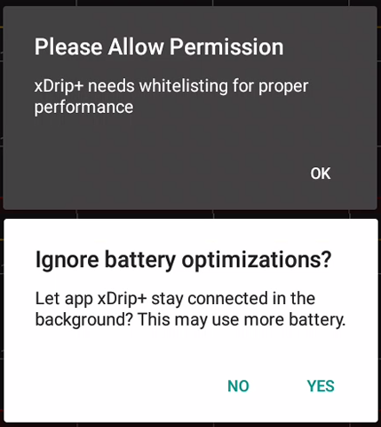
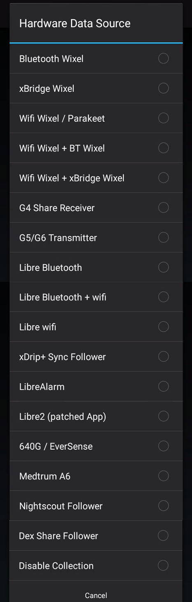

# Install xDrip+

## Prerequisites

You need an Android phone.

- Minimum supported Android version is 4.4 but 6 and above is recommended.
- If you will connect xDrip+ to a sensor your phone must support Bluetooth Low Energy (BLE): you can use utilities [like this](https://play.google.com/store/apps/details?id=com.myan.michaelyanyoga.bluetoothchecker) one to check.
- In order to connect to a Bluetooth CGM your phone needs to have location enabled (GPS).
- If you want to use the embedded master - follower function of xDrip+ (called xDrip+ Sync) your phone needs to have the [Google Play Services](https://play.google.com/store/apps/details?id=com.google.android.gms) installed.
- If you wish to use scanning features for Libre sensors your phone needs an NFC reader.
- If using Android 10 and above make sure you use a recent version of xDrip+ (see below).

 

## Which one to install?

xDrip+ is not available in the Google Play store by developers decision. You will find all releases in [Github](https://github.com/NightscoutFoundation/xDrip/releases).  
If you don't know which one to select you have two choices:

### Latest release

Latest release is a stable version of xDrip+. It doesn't have all the newest features but has proven stability and doesn't suffer severe bugs. It's a safe version to start with.

You can download it [here](https://xdrip-plus-updates.appspot.com/stable/xdrip-plus-latest.apk).

### Pre-release

Pre-release include most recent xDrip+ developments like translations, new features and bug fixes. And it might also contain some bugs... Still, it is the version you want to use to benefit most recent improvements.

All xDrip+ versions are available [here](https://github.com/NightscoutFoundation/xDrip/releases).

Expand the assets and select the `.apk` file. You will find it in your phone `Downloads` directory.

*Note: don't use Facebook links to download xDrip+ but copy and paste the link into a browser (like Chrome).*

 

#### Note: Private versions

Some developers add features and customizations that are not available in the official pre-releases until the author will create a Pull Request in xDrip+ and get it merged in the main project. You can use these versions but need to understand they might be supported only by their creator. xDrip+ automatic updates won't work with private versions.

 

## Install xDrip+

Once downloaded, install the xDrip+ apk.

**You need to authorize installation of apps from unknown sources in Android security settings.**  
xDrip+ is virus and malware free: being open source and controlled by the main developer make its distribution safe if you download it from GitHub.

Once installed, open xDrip+.

**Read** and acknowledge the important Warning.

​	Do NOT use or rely on this software or any associated materials for any medical purpose or decision.  
​	Do NOT rely on this system for any real-time alarms or time critical data.  
​	Do NOT use or rely on this system for treatment decisions or use as a substitute for professional healthcare judgement.  
​	All software and materials have been provided for informational purposes only as a proof of concept to assist possibilities for further research.  
​	No claims at all are made about fitness for any purpose and everything is provided **AS IS**. Any part of the system can fail at any time.  
​	Always seek the advice of a qualified healthcare professional for any medical questions.  
​	Always follow your glucose-sensor or other device manufacturers\' instructions when using any equipment; do not discontinue use of accompanying reader or receiver, other than as advised by your doctor.  
​	This software is not associated with or endorsed by any equipment manufacturer and all trademarks are those of their respective owners.  
​	Your use of this software is entirely at your own risk.  
​	No charge has been made by the developers for the use of this software.  
​	This is an open-source project which has been created by volunteers. The source code is published free and open-source for you to inspect and evaluate.  
​	By using this software and/or website you agree that you are over 18 years of age and have read, understood and agree to all of the above.

 

#### Authorize background activity

xDrip+ must have the right to run in background: it must be whitelisted to battery optimization. This is essential to a correct functioning. It should ask you to allow this authorization. If it doesn't or you need to verify this later, you'll have to check it in your phone `Settings` - `Apps` - `xDrip+`. Consult your phone manual as  it will depend on Android version and manufacturer.

 

## Select your data source

If you want to connect xDrip+ directly to your sensor, select it in the wizard.

 

If you don't see the wizard you can start it using the `START SOURCE SETUP WIZARD` button on the main screen.

 

If you don't see this button you can bring it back to display with a long press on the xDrip+ icon blood drop and enable source wizard button.

 

### Dexcom

In order to connect xDrip+ to a Dexcom G5 or G6 sensor you need to uninstall the Dexcom app from this phone or any other phone connected to it. The Dexcom receiver will continue to receive the sensor signal as it's using another Bluetooth channel.  
Note that xDrip+ will allow the use of Dexcom Share servers but will **not upload data to Clarity**. If you decide to use this solution, it is recommended to use [Tidepool](https://www.tidepool.org/) or [Nightscout](https://nightscout.github.io/) to generate your reports.

If you want to use xDrip+ but you still want to connect your sensor to the Dexcom app, go back to the first page and select Other. You can use xDrip+ either as a Dexcom Share follower (but you will need network access) or [build your own Dexcom app](https://docs.google.com/forms/d/e/1FAIpQLScD76G0Y-BlL4tZljaFkjlwuqhT83QlFM5v6ZEfO7gCU98iJQ/viewform?fbzx=2196386787609383750&fbclid=IwAR2aL8Cps1s6W8apUVK-gOqgGpA-McMPJj9Y8emf_P0-_gAsmJs6QwAY-o0) (enabling broadcast to xDrip+) and select 640G/670G or Eversense as the data source.

Else continue here:

Dexcom G4  
Dexcom G5  
Decom G6

 

### Freestyle Libre

You can use xDrip+ to scan your Libre (**Not** 14 days US version) sensor selecting the any of these data sources if your phone has an NFC reader. Note that there is only limited value in doing so as the only advantage is to be able to calibrate the readings. In order to get the best of xDrip+ it is recommended that you buy an additional bridge device doing the sensor scan automatically every 5 minutes.

Continue here:

Bridge devices like LimiTTer (obsolete), blueReader (obsolete), Blucon, miaomiao (Tomato), Bubble or Droplet  
Patched Sony SWR50  
Patched app (Libre 2 not **US** version)  
Libre 2 (**not** US version)

 

### Others

640G/670G for the Medtronic uploader app and the BYOD app.   
Medtrum A6/S7  
Nightscout Follower  
Dexcom Share Follower  
Eversense with the Esel app

 

### More

If you haven't found the data source you were looking for in the wizard you can select it from `Settings`.

Touch the back button on your phone until you're back to the main screen. Select the hamburger menu top left then `Settings`.

Select Hardware data source.

This will display the full list of available data sources.

 

#### Dexcom G4

Bluetooth Wixel  
xBridge Wixel  
Wifi Wixel / Parakeet  
Wifi Wixel + BT Wixel  
Wifi Wixel + Bridge Wixel  
G4 Share receiver

#### Dexcom G5 / G6

Dexcom G5  
Dexcom G6

