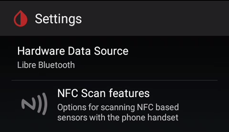
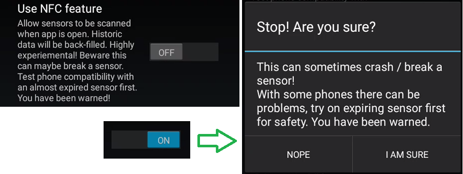
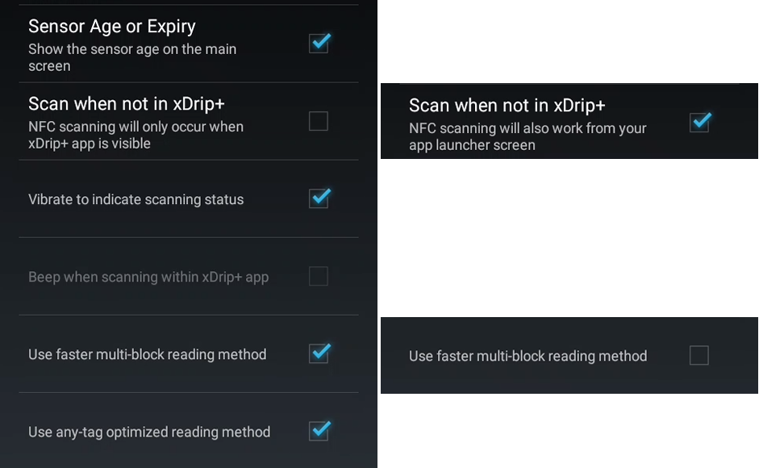

# Supported sensors and related settings

## G5 G6

In order to connect xDrip+ to a G5 or G6 sensor you need to uninstall the vendor app from this phone or any other phone connected to it. The receiver will continue to receive the sensor signal as it's using another Bluetooth channel.  
Note that xDrip+ will allow the use of Dex Share servers but will **not upload data to Clarity**. If you decide to use this solution, it is recommended to use [Tidepool](https://www.tidepool.org/) or [Nightscout](https://nightscout.github.io/) to generate your reports.

If you want to use xDrip+ but you still want to connect your sensor to the vendor app, you can use xDrip+ either as a Dex Share follower (but you will need network access) or [build your own app](https://docs.google.com/forms/d/e/1FAIpQLScD76G0Y-BlL4tZljaFkjlwuqhT83QlFM5v6ZEfO7gCU98iJQ/viewform) (enabling broadcast to xDrip+) and select 640G/670G or Eversense as the data source.

[G5](../g5)

[G6](../g6)

 

## Libre

You can use xDrip+ to scan your Libre (**Not** 14 days US version) sensor selecting the any of these data sources if your phone has an NFC reader. Note that there is only limited value in doing so as the only advantage is to be able to calibrate the readings.

If your phone has an NFC reader you can enable NFC readings.

`Menu` / `Settings` / `NFC Scan features`

Warning: If you have the vendor app installed on the same phone you use for xDrip+ they will conflict upon NFC sensor detection. Make sure to disable one or the other in Android `Settings` / `Apps` / `xDrip+` / `Permissions` / `control Near Field Communication`.

Enable `Use NFC feature`. If your phone allows the use of the vendor app, ignore the warning. It it doesn't: follow the recommendation and perform NFC scans on a sensor close to expiration date to check safety.

You can enable NFC scan when xDrip+ is not opened with `Scan when not in xDrip+`.  
If you have difficulties scanning, disable `Use faster multi-block reading method`.

 

In order to get the best of xDrip+ it is recommended that you buy (building one yourself will cost about the same) an additional bridge device doing the sensor scan automatically every 5 minutes. These are not necessary if you have a Libre 2 EU sensor, see below.

If you use a bridge device (LimiTTer - obsolete, blueReader - obsolete, Blucon, miaomiao / Tomato, Bubble or Droplet) you must uninstall the vendor app or disconnect the bridge from it.

[Bridge devices](../libre-bridge) 

[LibreAlarm](../libre-swr50) (patched SWR50 - obsolete)

[Patched app](../libre-patched) (Libre 2 EU)

Using the Libre 2 with direct Bluetooth connection will conflict with the reader and the vendor app, once connected to xDrip+ the sensor won't be able to send alarms to the device or the vendor app.

[Libre 2 EU](../libre2)

 

## Others

[640G/670G](../medtronic) (using the Medtronic uploader and a OTG wired glucometer)

[G5/G6 BYO app](../byo)

[Medtrum](../medtrum)

[Eversense](../eversense) (using the Esel app)