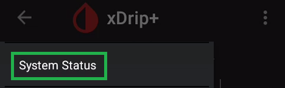
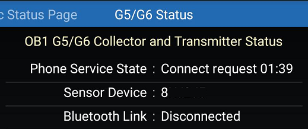
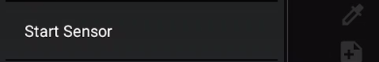
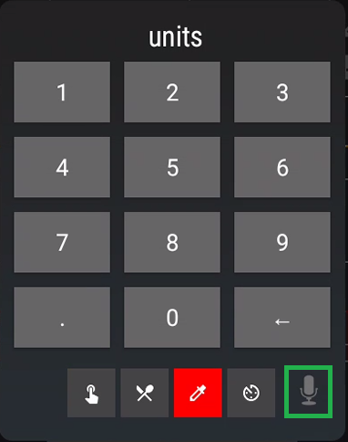

# Start sensor

Make sure you have xDrip+ setup correctly: see [G5](../g5) [G6](../g6).

## Use only one device

If you have a receiver or normally use the vendor app, it's now time to decide which device you will want to use to start and stop your sensors. Use only one and make sure the other devices are either turned off or stored in a shielding bag (or a microwave oven turned OFF). When starting a sensor, do not let the receiver interact before warm-up is complete and you have readings in xDrip+.

 

At this point make sure you have a sensor inserted (already started or a new one) with the transmitter attached. You will not be able to connect to the transmitter if it is not attached to the sensor.

 

## Check connection

`Menu` / `System Status`

Once on this page swipe leftwards to display `G5/G6 Status`

xDrip+ will first try try to find the transmitter. Keep it close to the phone and leave the app on this page.

Once found it will try to connect to it. If xDrip+ doesn't find it, check again the transmitter code.

**Note: ** the sensor will communicate every 5 minutes, the rest of the time it will be sleeping. Last connected should **not** be more than 5 minutes. If it doesn't connect check your [settings](../g6).

 

## Stop the old sensor if necessary

Before starting a new sensor, the previous one should be stopped (only if you are replacing it). If the sensor is already started and you don't want to replace it, go ahead and start sensor anyway with xDrip+.

**DO NOT STOP A SENSOR UNLESS YOU WANT TO REMOVE IT.**

Before stopping your sensor make sure the command queue is empty:

Check the status `Menu` / `System Status` 

If there are actions pending wait 20 minutes until they expire or get rejected.

Queued items remaining stuck might be because of bad settings preventing communication to the transmitter. Check your settings [here](../g6) and eventually [delete them](#empty-the-command-queue),. 

Open the menu and select `Stop sensor`. If you only see `Start sensor` continue [below](#start-a-sensor-or-use-a-sensor-already-started) (don't start it yet).

Confirm `STOP SENSOR`

Check the status `Menu` / `System Status` and wait until your sensor stops.

The stop command will queue until next connection and then your sensor will stop. It might take more than 5 minutes. Do not send other commands until the queue is empty.

If you have commands stuck in the queue, [delete them](#empty-the-command-queue), check connection and stop sensor.

 

## Start a sensor or use a sensor already started

Starting a new sensor with xDrip+ or connecting a sensor started by the vendor app or the receiver is identical.

Open the menu and select `Start sensor`. If you only see `Stop sensor` go back [here](#stop-the-old-sensor-if-necessary).

Confirm `START SENSOR`

If you inserted the sensor today (i.e. not started or recently started), answer `YES, TODAY`

If you answered today select the hour dragging the blue pointer to the correct time. With 12 hours display, tap `am` or`pm`. With 24 hours display drop the correct hour either on the inner or outer ring for the correct hour. Tap `OK`.

Drag the minutes blue pointer to the correct time and tap `OK`.

Check the status `Menu` / `System Status` to monitor startup. You will see the start command queued until next connection.

After the sensor start command is processed, xDrip+ will ask for the calibration code provided with the sensor (only non-started sensor).

The newly started sensor will start warm-up. You can see the remaining time in system status.

If you're using an already started sensor you will have readings within 10 minutes. If you see a purple arrow you might have made a mistake in the date and time the sensor was started as BG data is available but won't display during the 2 hours warm-up.

 

## Empty the command queue

Commands are processed by the transmitter one by one when received. Interactions occur every 5 minutes so it might take some time before they get processed. If you still see them pending after 20 minutes you might want to [check connection](#check-connection) and then delete them manually.

From the main view, touch the syringe (treatments) icon.

Long touch the microphone icon. 

Write `clear transmitter queue` then `OK`.

